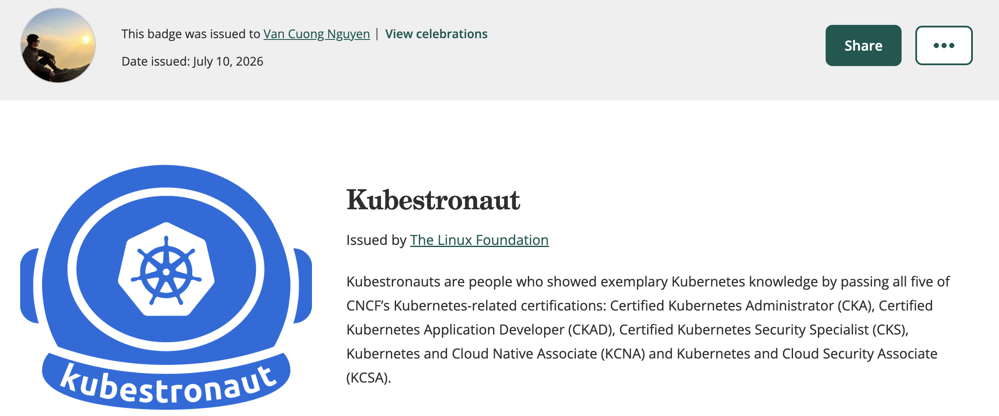
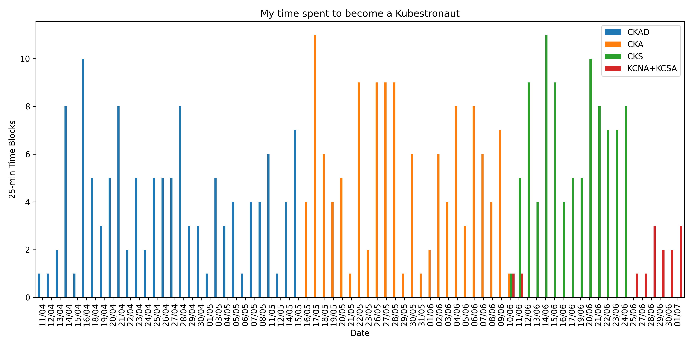

# Hành trình chinh phục Kubestronaut trong 3 tháng

Mình vừa hoàn thành 5 chứng chỉ Kubernetes: CKA, CKAD, CKS, KCNA và KCSA để trở thành một Kubestronaut. Bài viết này tổng hợp lại những kinh nghiệm của mình trong quá trình chuẩn bị cho các chứng chỉ này. Hy vọng sẽ hữu ích cho các bạn. 


Background mình bên AI/ML, trước khi bắt đầu chưa có kinh nghiệm với Kubernetes, nhưng nền tảng về phần mềm, OS, Networking, System Design, Cloud (AWS) rất vững. Nền tảng này giúp mình học nhanh hơn, và với các bạn đã có kinh nghiệm với Kubernetes thì mình nghĩ có thể nhanh hơn nữa. 


Mình bắt đầu từ 11/4/2026, khoảng thời gian này DevOps VN bắt đầu triển khai chương trình đặc quyền kép, vốn có ý định học Kubernetes trước đó nên mình bắt đầu luôn. Hoàn thành chứng chỉ cuối cùng vào 1/7, dành tổng cộng 142 giờ (mình có track thời gian), tức trung bình khoảng 1.75-2h mỗi ngày, và do tập trung học liền mạch nên tiết kiệm thời gian và công sức hơn. Dưới đây là phân bổ thời gian chi tiết dành cho việc học thi của mình trong giai đoạn này:




Tài liệu học duy nhất là các khoá học của KodeKloud. Dưới đây là chi tiết từng phần, xếp theo thứ tự thi: CKAD -> CKA -> CKS -> KCNA/KCSA. 


## 2. CKAD


### 2.1. Khoá học

Mình học khóa CKAD của KodeKloud trên Udemy. Video bài giảng và đặc biệt lab thực hành rất hữu ích. Nếu bạn chưa có kinh nghiệm Kubernetes trước đó, mình khuyên nên xem video trước rồi làm lab. Nếu đã có kinh nghiệm, bạn có thể vào lab luôn, sau đó có thể xem lại video nếu cần để củng cố kiến thức.

Lightning Labs: có 2 bài lab lớn yêu cầu thiết lập các thành phần đã học để xây dựng một hệ thống nhỏ. Dài hơn nhiều so với một câu trong kỳ thi thật, nhưng rất đáng làm.


### 2.2. Mock exam

- 2 đề của KodeKloud (trong khoá học): rất dễ nếu bạn đã hoàn thành Lightning Labs.

- Killer.sh: có 2 session được cung cấp khi đăng ký thi, tuy nhiên với CKAD thì 2 session này có cùng bộ câu hỏi. Dài và khó hơn thi thật, nhưng giúp làm quen với môi trường thi và cách chấm điểm. Mình cũng khá enjoy làm Killer.sh, một số kỹ thuật với shell scripting trong đáp án cũng khá hữu ích.

### 2.3. Tips

Ngoài các [chia sẻ của bạn Khánh Linh](https://devops.vn/posts/chia-se-tai-lieu-va-qua-trinh-on-tap-thi-ckad/), mình bổ sung thêm như sau:

- Chọn câu hỏi một cách hợp lý. Hãy làm các chủ đề bạn quen tay trước. Trong bài thi, ở đầu mỗi câu sẽ có link tới tài liệu chính thức của K8s, với tên chủ đề tương ứng (ví dụ: Services, ConfigMaps, Secrets). Hãy **lướt dòng đó trước để nhận diện chủ đề. Sau đó, nếu quen thì đọc câu hỏi, rồi nếu tự tin xử lý được thì bắt đầu làm**. Nếu không thì chuyển sang câu khác. Vì CKAD dễ nên bạn có thể làm tuần tự, nhưng cho CKA và CKS thì mình nghĩ sẽ có ích.

- Vì có chấm điểm từng phần, hãy làm càng nhiều tác vụ trong một câu càng tốt để tối đa hóa điểm số. Kể cả với các câu hỏi khó, vẫn có những phần dễ có thể làm được.

- **Imperative command**: cần nhớ để tạo nhanh các resource, tiết kiệm thời gian. 


- Mình thường dùng `-n <namespace>` ngay sau `kubectl` (hoặc alias `k` được thiết lập sẵn) để tránh quên namespace. Hạn chế lỗi do sai namespace. 

- Nhớ short name của các resource để thao tác nhanh hơn: `deploy` cho deployment, `svc` cho service, `cm` cho configmap, `sa` cho serviceaccount, `ns` cho namespace, v.v.

- Một vài thao tác với `vim`:
    - `dd` để xóa dòng hiện tại trong normal mode, `d2d` để xóa 2 dòng, `d3d` để xóa 3 dòng, v.v. `d$` để xóa từ con trỏ tới cuối dòng.
    - Nhiều lúc bạn sẽ cần copy YAML của `pod` từ tài liệu chính thức vào podTemplate trong YAML của `deployment`, đây là cách **chỉnh tab nhiều dòng cùng lúc**: đầu tiên nhấn `ESC` để về normal mode, di chuyển tới dòng đầu tiên, sau đó nhấn `Ctrl V` để vào visual block mode, dùng `j` hoặc mũi tên xuống để chọn các dòng sẽ tab, rồi:
    - `Shift >` để tab sang phải. `2 Shift >` tương đương 2 lần tab, `3 Shift >` là 3 lần, v.v.
    - `Shift <` để tab sang trái. `2 Shift <` 2 lần, `3 Shift <` 3 lần, v.v.


Mình mất khoảng 5 tuần để hoàn thành CKAD, 4 tuần cho khoá học/lab, 1 tuần mock exam và thi thật. Thi xong mình cũng khá tự tin đúng gần hết, nhưng kết quả chỉ đạt 86% :)))


## 3. CKA

Sau khi thi xong CKAD, có đợt khuyến mại MegaMay. Mình quyết định mua bundle CKA + CKS, và bắt đầu ngay lập tức.


### 3.1. Khoá học

Mình học khóa CKA của KodeKloud trên Udemy.
Khoảng 60% nội dung trùng với CKAD. Ngoài ra còn có:

- Troubleshooting: `kubelet`, `kube-apiserver`, `etcd`, `kube-controller-manager`, `kube-scheduler`, hoặc lỗi ứng dụng như ImagePullBackOff, CrashLoopBackOff, v.v.
- Cluster Maintenance: nâng cấp bằng `kubeadm`, backup và restore từ `etcd`, v.v.
- TLS, Certificate, DNS
- DaemonSet, Static Pod, HorizontalPodAutoscaler
- Gateway API
- Helm và Kustomize


Nên dành thời gian tự thiết lập một cluster nhỏ với `kubeadm`. Mình dùng [Multipass](https://canonical.com/multipass) để tạo VM Ubuntu trên Mac, thử cả [thiết lập thủ công](https://github.com/mmumshad/kubernetes-the-hard-way) (tự tạo TLS certificate rồi sao chép thủ công đến từng VM, tự cấu hình networking, DNS, v.v.) và dùng `kubeadm`. 


### 3.2. Mock exam


- KodeKloud: 3 đề. Độ khó tương đương kỳ thi thật.

- Killer.sh: 2 session với bộ câu hỏi khác nhau. Câu hỏi dài và khó hơn kỳ thi thật. 


### 3.3. Tips


Ngoài các [chia sẻ của bạn Phi Hùng](https://devops.vn/posts/chinh-phuc-chung-chi-cka-certified-kubernetes-administrator/), mình bổ sung thêm như sau:


- Khi thi, bạn nên dùng 2 terminal. Một số câu hỏi yêu cầu bạn chỉnh manifest file trong khi vẫn phải kiểm tra cấu hình hiện tại của cluster cùng lúc. Ví dụ, các câu về network policy thường yêu cầu match đúng label của pod, bạn sẽ không muốn liên tục thoát ra để copy rồi lại vào `vim` để paste.

- Chọn thứ tự làm bài hợp lý. Hãy làm các chủ đề bạn quen trước. Trong bài thi, ở đầu mỗi câu sẽ có link tới tài liệu chính thức của K8s, với tên chủ đề tương ứng (ví dụ: Services, ConfigMaps, Secrets). Hãy **lướt dòng đó trước để nhận diện chủ đề. Sau đó, nếu quen thì đọc câu hỏi, rồi nếu tự tin xử lý được nhanh thì bắt đầu làm**.  Nếu không thì chuyển sang câu khác trước. Cá nhân mình sẽ để mọi câu troubleshooting làm SAU CÙNG, vì khó mà biết nó sẽ tốn bao nhiêu thời gian chỉ bằng cách đọc câu hỏi. Về cơ bản, đề chỉ nói rằng có vấn đề với `kubelet`, `kube-apiserver` hoặc `etcd` và yêu cầu sửa.

- **Backup static pod YAML file trước khi chỉnh sửa**: áp dụng cho các câu hỏi về `kube-apiserver`, `kube-controller-manager`, `kube-scheduler` và `etcd`. Nếu bạn "làm loạn" manifest file, khôi phục về trạng thái ban đầu bằng bản backup để thử lại. Đây là kinh nghiệm xương máu, mình fail một câu troubleshoot `kube-apiserver` vì không backup, sau một lần chỉnh sửa, save rồi kiểm tra container vẫn không chạy, muốn khôi phục để làm lại mà không được.


```sh
cp /etc/kubernetes/manifests/kube-apiserver.yaml kube-apiserver.yaml
```

Và nếu cần reset, ghi đè lại:

```sh
cp kube-apiserver.yaml /etc/kubernetes/manifests/kube-apiserver.yaml
```


- Luyện Helm (và Kustomize). Helm dễ ra hơn, Kustomize thì cần chỉnh sửa YAML nhiều hơn (để patch, overlay, v.v.), mất nhiều thời gian hơn nên mình nghĩ ít bị hỏi. Mình không ôn kỹ Helm nên đã fail 1 câu.


Mất tổng cộng gần 4 tuần hoàn thành CKA, 2 tuần cho khoá học/lab, 1 tuần tự build và nghịch cluster, 1 tuần mock exam và thi thật. Mình thi tệ hơn CKAD, bỏ 3/15 câu: 1 câu troubleshoot và 1 câu Helm ở trên, câu còn lại là về Pod Topology Spread Constraint. Pass với 72%.


## 4. CKS

Tập trung vào bảo mật K8s, yêu cầu có CKA trước khi thi. Nội dung bao gồm:

- Cluster Security:
    - `kube-bench` để xác định các vấn đề bảo mật theo CIS benchmark và áp dụng biện pháp khắc phục.
    - Certificate, Mutual TLS, Kubeconfig, RBAC, Service Account. Tương tự CKA.
    - Network Policy: cả native K8s policy và Cilium policy.
    - Kubelet Security: anonymous authentication, read-only port

- System Security:
    - Bảo mật host: users, groups, permissions, SSH
    - Firewall mạng: `ufw`

- Pod Security:
    - Pod Security Standard và Pod Security Admission
    - Admission Controller
    - Open Policy Agent (OPA) và Gatekeeper
    - Mã hóa pod-to-pod với Istio `PeerAuthentication`

- Container Security:
    - Security Context: `readOnlyRootFilesystem`, `runAsNonRoot`, `runAsUser`, `runAsGroup`, `allowPrivilegeEscalation`.
    - Seccomp, AppArmor để giới hạn system call.
    - Custom container runtime: gVisor, Kata Container.

- Code Security:
    - Static analysis: có thể yêu cầu đọc mã nguồn thủ công để phát hiện các vấn đề như lộ credential, hoặc dùng công cụ như `kube-linter`
    - Tạo SBOM dùng `bom`, `syft` hoặc `trivy`
    - Quét Docker image để tìm lỗ hổng bằng `trivy`
    - Quét K8s yaml file để tìm lỗ hổng bằng `kubesec`

- Monitoring, Logging, Runtime Security:
    - Audit log: thiết lập audit log cho cluster bằng cách cấu hình trong `kube-apiserver`.
    - Threat Detection: viết rule cho Falco với custom output, hoặc `grep` Falco log để tìm pod/deployment có vấn đề bảo mật rồi sửa lại.


### 4.1. Khoá học

Mình học khóa CKS của KodeKloud, không có trên Udemy, nên mình subscribe trực tiếp trên nền tảng KodeKloud, gói Standard, 29 USD/tháng. Đặt mục tiêu hoàn thành trong 1 tháng để tiết kiệm chi phí, cũng là một động lực tốt.


Mình thử đổi cách học với CKS, nhảy thẳng vào làm lab mà không xem video trước. Trong khi làm tự tìm hiểu các khái niệm, câu lệnh, cấu hình cần thiết. Sau khi hoàn thành lab, xem lại video nếu vẫn còn khúc mắc, và cũng để nhìn rõ bức tranh tổng thể. Mình nghĩ cách này tiết kiệm thời gian hơn nếu nền tảng đã vững, vì các chủ đề trong đề thi CKS cũng không khó.


### 4.2. Mock exam

Như thường lệ, mình chỉ dùng 2 nguồn:

- KodeKloud: 3 mock exam có sẵn trong khóa học. Có một số câu hỏi trùng nhau, khoảng 30-50%, mình nghĩ team cố tình thiết kế vậy vì chúng xuất hiện khá thường xuyên trong kỳ thi thật. Hãy làm lại cho đến khi đạt 90%. Lưu ý rằng KodeKloud không chấm điểm từng phần như kỳ thi thật, bạn cần hoàn thành ĐÚNG TẤT CẢ các phần của một câu thì mới có điểm, còn sai bất kỳ phần nào sẽ là 0. Nên điểm trên đây không phản ánh chính xác. Mình nghĩ nếu bạn đạt trên 75% thì đã sẵn sàng thi thật.


- Killer.sh: 2 session với bộ câu hỏi khác nhau, dài và khó hơn kỳ thi thật. Mình chỉ đạt 60% và 52% cho 2 session này, nhưng cũng khá enjoy quá trình làm, và cũng học được khá nhiều tư duy và kỹ thuật hữu ích khi đọc đáp án.


Mình mất 2 tuần cho CKS, ngay sau khi hoàn thành CKA. 1 tuần cho course, và 1 tuần làm mock exam và thi. Pass với 82%, thấp hơn kỳ vọng (mình nghĩ mình làm khá tốt, chỉ sai khoảng 1 câu).


### 4.3. Tips

Ngoài các tips cho CKA như dùng 2 terminal, chọn câu hỏi hợp lý, backup static pod YAML, v.v., mình bổ sung thêm cho CKS như sau:

- Với Pod Security Admission, câu dễ chỉ là gắn label cho namespace với `pod-security.kubernetes.io/<MODE>: <LEVEL>`. Câu khó hơn là kiểm tra vì sao pod không được tạo và chạy do vi phạm policy, rồi sửa lại. Bạn có thể dùng `kubectl get deploy/pod <name> -o yaml` và tìm `.status.conditions[].message`. Đáp án nằm ngay ở đó và rất rõ ràng. Mình đã gặp một câu như vậy trong kỳ thi, và ban đầu hơi rối vì không biết tìm lỗi ở đâu. `kubectl describe` không hiển thị event đó.


Ví dụ, `kubectl describe deploy` hiển thị:

```sh
Events:
	Type    Reason             Age   From                   Message
	----    ------             ----  ----                   -------
	Normal  ScalingReplicaSet  30s   deployment-controller  Scaled up replica set test-6bc97d7d78 from 0 to 1
```

Không có gì hữu ích ở đây.

Nhưng `kubectl get deploy -o yaml` sẽ cho ra:

```yaml
status:
	conditions:
	- lastTransitionTime: "2026-06-26T17:28:17Z"
		lastUpdateTime: "2026-06-26T17:28:17Z"
		message: Created new replica set "test-6bc97d7d78"
		reason: NewReplicaSetCreated
		status: "True"
		type: Progressing
	- lastTransitionTime: "2026-06-26T17:28:17Z"
		lastUpdateTime: "2026-06-26T17:28:17Z"
		message: Deployment does not have minimum availability.
		reason: MinimumReplicasUnavailable
		status: "False"
		type: Available
	- lastTransitionTime: "2026-06-26T17:28:17Z"
		lastUpdateTime: "2026-06-26T17:28:17Z"
		message: 'pods "test-6bc97d7d78-s89x2" is forbidden: violates PodSecurity "restricted:latest": allowPrivilegeEscalation != false (container "nginx" must set securityContext.allowPrivilegeEscalation=false), unrestricted capabilities  (container "nginx" must set securityContext.capabilities.drop=["ALL"]), runAsNonRoot != true (pod or container "nginx" must set securityContext.runAsNonRoot=true), runAsUser=0 (container "nginx" must not set runAsUser=0), seccompProfile (pod or container "nginx" must set securityContext.seccompProfile.type to "RuntimeDefault" or "Localhost")'
		reason: FailedCreate
		status: "True"
		type: ReplicaFailure
	observedGeneration: 1
	terminatingReplicas: 0
	unavailableReplicas: 1
```

Đến đây làm theo chỉ dẫn trong `message` để sửa lại là xong.


- Có hai câu hỏi phổ biến yêu cầu chỉnh manifest file của `kube-apiserver`: bật audit logs và bật admission controller. Với cả hai dạng câu hỏi, đừng quên mount đúng file hoặc thư mục cho cấu hình audit hoặc admission policy. 


- Với câu hỏi về Falco, hãy chuẩn bị tinh thần ít nhất là phải viết custom output hoặc thậm chí là rule. Trong kỳ thi bạn sẽ có quyền truy cập tài liệu Falco, nhưng trước đó nên làm quen với tài liệu để tìm kiếm nhanh. Trang mình thấy hữu ích là "Supported Fields for Conditions and Outputs", liệt kê đầy đủ tên field cho output hoặc condition.

Nên nhớ cách điều hướng tới đó trong bài thi: Falco docs -> Reference -> Rules -> Supported Fields for Conditions and Outputs.


- Tương tự, với Cilium network policy, trang hữu ích là Overview of Network Policy. Nhấn vào link Layer3/4 để tìm manifest mẫu tùy theo yêu cầu của câu hỏi.


## 5. KCNA & KCSA


Đây là hai chứng chỉ lý thuyết về Kubernetes và hệ sinh thái của nó. Hình thức thi là câu hỏi trắc nghiệm. Câu hỏi và câu trả lời ngắn gọn, súc tích, không có cách diễn đạt đánh đố.

Thành thật mà nói, mình không nghĩ hai chứng chỉ này có giá trị bằng CKA, CKAD hay CKS, vì chúng chỉ thuần lý thuyết suông và giá cũng đắt. Chỉ nên thi nếu bạn muốn đạt danh hiệu Kubestronaut :)))


Từ [chia sẻ của anh Vũ Công Thạo](https://devops.vn/posts/lam-the-nao-toi-chinh-phuc-golden-kubestronaut), mình cũng không chủ quan với KCSA. Gói KodeKloud 1 tháng của mình vẫn còn hiệu lực sau khi thi CKS, nên mình chuyển luôn sang các khóa KCNA và KCSA, và làm mock exam vào ngày trước khi thi. Khá hữu ích, vì nhiều câu cũng xuất hiện trong đề thi thật.


## 6. Chi phí

- Chi phí cho các khoá học trên KodeKloud và Udemy của mình tổng khoảng 70 USD. Với Udemy thì cố gắng tìm mã giảm giá để tiết kiệm. 

- **Chi phí thi**: tổng chi phí các chứng chỉ đơn lẻ là 1835 USD, một con số không nhỏ. Nhờ chương trình đặc quyền kép của DevOps VietNam, chi phí mình tiết kiệm được như sau:

    - CKAD: giảm giá 40% + hoàn tiền 15%, chỉ còn khoảng 227 USD
    - CKA + CKS bundle: giảm 60% + hoàn tiền 10%, tổng khoảng 355 USD.
    - KCNA + KCSA bundle: giảm 50% + hoàn tiền 10%, tổng khoảng 203 USD.

Tổng cộng chi phí thi chỉ còn 785 USD! Mình xin cảm ơn DevOps VietNam đã tạo điều kiện thông qua các ưu đãi, để chi phí không còn là rào cản quá lớn cho anh chị em kỹ sư VN.


## 7. Tổng kết

Trên đây mình đã tổng hợp lại trải nghiệm của bản thân trong quá trình đạt danh hiệu Kubestronaut. Hy vọng sẽ hữu ích cho các bạn đang có ý định chinh phục các chứng chỉ này. Chúc các bạn thành công!


P/S 1: Bản tiếng Anh của bài viết này có thể xem tại [GitHub repo này](https://github.com/cuongvng/kubestronaut). Nếu có câu hỏi, bạn có thể bình luận xuống phía dưới, hoặc tạo Issue trên repo.

P/S 2: Ngoài ra, mình cũng là tác giả blog [AWS Cơ Bản (awscoban.com)](https://awscoban.com), nơi mình đã dành ra 6 tháng hệ thống hóa toàn bộ kiến thức cốt lõi (VPC, IAM, EC2, S3, RDS, Lambda, v.v.), bao trọn 90-95% nội dung trọng tâm của kỳ thi SAA-C03. Dù hiện tại hỏi đáp với AI rất phổ biến, nhưng việc xâu chuỗi các chủ đề mạch lạc với nhau sẽ giúp các bạn liên kết và dễ nhớ hơn, đồng thời cũng biết cách nhìn vấn đề một cách tổng thể. Đó là lý do mình xây dựng blog này.
